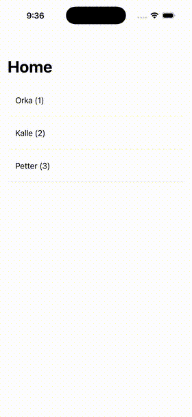

# LogSee

*[Lire en Français](README_FR.md)*

A lightweight, channel-based logging framework for Swift with a built-in SwiftUI debug viewer.


<p align="center">
  
</p>

## Features

- **Channel-based logging** - Organize logs by category (Network, Auth, Database, etc.)
- **Real-time streaming** - Subscribe to logs via `AsyncStream`
- **SwiftUI debug viewer** - Built-in UI to browse and filter logs
- **Log notifications** - Floating overlay showing live logs
- **Custom channels** - Define your own log categories with emojis
- **Zero production overhead** - All logging is compiled out in Release builds
- **Swift 6 ready** - Full concurrency support with `Sendable` types

## Installation

### Swift Package Manager

Add LogSee to your `Package.swift`:

```swift
dependencies: [
    .package(url: "https://github.com/AccorECOM/ios-LogSee.git", from: "1.0.0")
]
```

Then add the products you need to your target:

```swift
.target(
    name: "YourApp",
    dependencies: [
        "Logger",  // Core logging functionality
        "LogSee"   // SwiftUI debug viewer (optional)
    ]
)
```

Or in Xcode: **File > Add Package Dependencies...** and enter the repository URL.

## Quick Start

### Basic Logging

```swift
import Logger

let logger = Logger.shared

// Log with default channels
logger.log("Request started", channel: .network)
logger.log("User signed in", channel: .auth)
logger.log("Query executed", channel: .database, level: .info)
logger.log("Something failed", channel: .error, level: .error)

// Log with additional context
logger.log(
    "API call completed",
    channel: .network,
    level: .info,
    env: [
        "url": "https://api.example.com/users",
        "statusCode": 200,
        "duration": 0.35
    ]
)
```

### Default Channels

| Channel | Emoji | Usage |
|---------|-------|-------|
| `.network` | `🌐` | API calls, requests, responses |
| `.database` | `🗄️` | Database operations |
| `.auth` | `🔐` | Authentication events |
| `.error` | `❌` | Errors and failures |
| `.debug` | `🐛` | Debug information |
| `.info` | `ℹ️` | General information |

### Custom Channels

```swift
extension LogChannel {
    static let analytics = LogChannel(id: "analytics", title: "Analytics", emoji: "📊")
    static let payment = LogChannel(id: "payment", title: "Payment", emoji: "💳")
}

// Configure at app startup
await Logger.configure(channels: LogChannel.defaultChannels + [.analytics, .payment])

// Use your custom channels
Logger.shared.log("Purchase completed", channel: .payment, level: .info)
```

### Analytics Payload Validation

The library lets your app inject its own payload validation strategy:

```swift
Logger.setPayloadValidationProvider(channelID: "analytics_events") { log in
    let expected = ["requiredFieldA", "requiredFieldB"]
    let missing = expected.filter { key in
        guard let value = log.env[key] as? String else { return true }
        return value.trimmingCharacters(in: .whitespacesAndNewlines).isEmpty
    }

    return Logger.Log.PayloadValidation(
        eventIdentifier: log.message,
        expectedKeys: expected,
        missingKeys: missing
    )
}
```

Each matching log then contains `log.payloadValidation` with:
- expected keys
- missing keys
- completion status (`isComplete`)

## Debug Viewer

LogSee provides two UI components for debugging:

| Component | Description |
|-----------|-------------|
| `LogSeeModuleFactory.makeAnalyticsView()` | Full-screen log browser with filtering |
| `LogSeeModuleFactory.initLogNotificationModule()` | Floating overlay showing live logs |

See the **Demo App** for a complete integration example with shake-to-open gesture.

## Architecture

LogSee is split into two modules:

- **Logger** - Core logging functionality with no UI dependencies
- **LogSee** - SwiftUI debug viewer that depends on Logger

This allows you to use just the Logger module in packages or frameworks that don't need the UI.

## Requirements

- iOS 16.0+ / macOS 13.0+ / tvOS 16.0+
- Swift 6.0+
- Xcode 16.0+

## Demo App

The `LogSeeDemo` folder contains a complete example app demonstrating:
- Channel configuration
- Log notifications overlay
- Shake gesture to open the debug viewer
- Custom channel definitions

## License

LogSee is available under the Apache License 2.0. See the [LICENSE](LICENSE) file for details.
